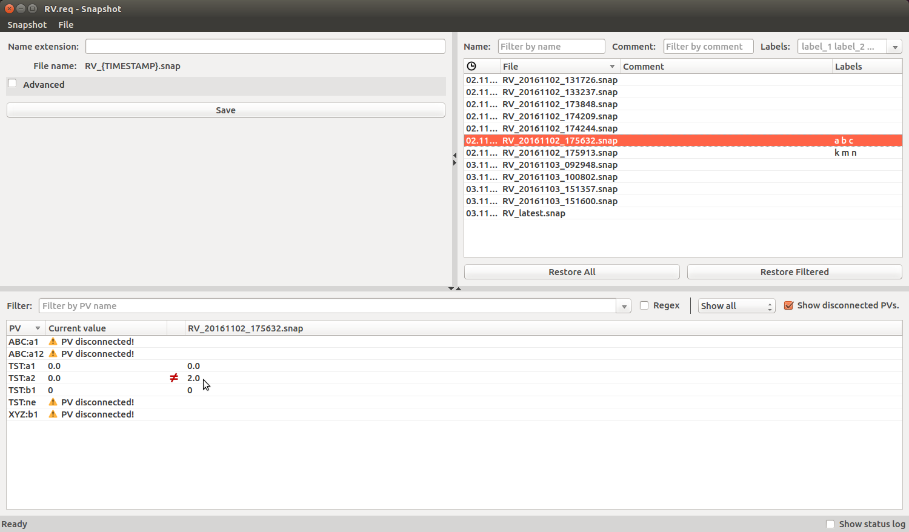

[](https://travis-ci.org/paulscherrerinstitute/snapshot) [](https://ci.appveyor.com/project/simongregorebner/snapshot)

# Overview
Snapshot is Python based tool with a graphical user interface which is able to
store (and later restore) values of Channel Access process variables (PVs).



# Installation

Snapshot is available as an Anaconda package on the paulscherrerinstitute
Anaconda package channel. It can be easily installed as follows:

```bash
conda install -c https://conda.anaconda.org/paulscherrerinstitute snapshot
```

# Usage
To define a set of PVs which should be saved/restored the _snapshot_ tool
requires a "request" file. Request files are in the following format. Beside
accepting explicit channels also the use of macros are possible. From version
1.5.0 on, request files format was extended to support nested loading of request
files. From version 2.0.26 on, the request file can begin with a JSON
configuration (see further down for details).

```
examplePv:test-1
examplePv:test-2
$(SYS):test-3

# Loading other request files with different macro values
!./relative/path/file1.req, "SYS=$(SYS),ID=1"
!./relative/path/file1.req, "SYS=$(SYS),ID=2"

# Also from absolute path
!/absolute/path/file2.req, "SYS=$(SYS),ID=1"
```

After snapshot is build and deployed as conda package (see section
[Instalation](#installation) it can be used in graphical mode or as command line
tool.

To use graphical interface snapshot must be started with following command:

```bash
snapshot [-h] [-m MACRO] [-d DIR] [-b BASE] [-f] [--labels LABELS] [--force_labels] [--config CONFIG] [FILE]

Longer version of same command:
snapshot gui [-h] [-m MACRO] [-d DIR] [-b BASE] [-f] [--labels LABELS] [--force_labels] [--config CONFIG] [FILE]

positional arguments:
  FILE                  request file.

  -h, --help            show this help message and exit
  -m MACRO, --macro MACRO
                        macros for request file e.g.: "SYS=TEST,DEV=D1"
  -d DIR, --dir DIR     directory for saved snapshot files
  -b BASE, --base BASE  base directory for request files
  -f, --force           force save/restore in case of disconnected PVs
  --labels LABELS       list of comma separated predefined labels e.g.:
                        "label_1,label_2"
  --force_labels        force predefined labels
  --config CONFIG       path to configuration file
```

The `--config` option is deprecated, although it remains. It is recommended
that the configuration snippet is stored in the beginning of the request file.

To be used as command line tool it must be run either with `snapshot save` or
`snapshot restore` depending on action needed.

```bash
snapshot save [-h] [-m MACRO] [-o OUT] [-f] [--timeout TIMEOUT] FILE

positional arguments:
  FILE                  request file

optional arguments:
  -h, --help            show this help message and exit
  -m MACRO, --macro MACRO
                        macros for request file e.g.: "SYS=TEST,DEV=D1"
  -o OUT, --out OUT     Output path/file.
  -f, --force           force save in case of disconnected PVs after timeout
  --labels LABELS       list of comma separated labels e.g.: "label_1,label_2"
  --comment COMMENT     Comment
  --timeout TIMEOUT     max time waiting for PVs to be connected
```

```bash
snapshot restore [-h] [-f] [--timeout TIMEOUT] FILE

positional arguments:
  FILE               saved snapshot file

optional arguments:
  -h, --help         show this help message and exit
  -f, --force        force restore in case of disconnected PVs after timeout
  --timeout TIMEOUT  max time waiting for PVs to be connected and restored
```

## Format of configuration

The config snippet must be the first thing in the request file, before even any
comments. See the [example request file](example/test.req). It may contain the
following keys:

- "labels": a dict containing:
  * "labels": an array of labels that can be applied to snapshot files.
  * "force-labels": a boolean. If true, only labels defined here will be
    available for saving in the snapshot files. If false, additional labels that
    may be present in the existing files will also be available.

- "filters": a dict containing:
  * "filters": an array of predefined PV name filters that will be available
    from the filter drop-down menu.
  * "rgx-filters": same as "filters", except the filters are in regular
    expression syntax.

- "machine_params": an array of machine parameters, i.e. PVs that are not part
  of the request file, but whose values will be stored as metadata. It is an
  array of pairs `["param_name", "pv_name"]`, e.g. `["electron_energy",
  "SARCL02-MBND100:P-READ"]`. Within the program, the parameter is referred to
  as `param_name` for display and filetering purposes."


## Format of saved files
When PVs values are saved using a GUI, they are stored in file where first line
starts with `#` and is followed by meta data (json formating). This is followed
by lines with PV names and saved data (one line per PV). Example:

```
#{"keywords": "key1,key2", "comment": "This is comment", "save_time": 1452670573.6637778}
examplePv:test-1,20
examplePv:test-2,30
examplePv:test-3,"string"
examplePv:test-4,[5.0, 6.0, 7.0, 8.0, 9.0, 0.0, 1.0, 2.0, 3.0, 4.0]
```

## Advanced usage of snapshot
Snapshot can also be used as a module inside other python applications. Find
simple example bellow. For more details have a look at
[example/example.py](./example/example.py).


```python
from snapshot.ca_core import Snapshot

snapshot = Snapshot('path/to/my/request/file.req')
snapshot.save_pvs('path/to/desired/save/file.snap')
snapshot.restore_pvs('path/to/desired/save/file.snap', callback=my_restore_done_callback)
snapshot.restore_pvs_blocking('path/to/desired/save/file.snap')
```

# Development
## Testing
To test the application a softioc can be started as follows (while being in the
_tests_ directory):

```
docker run -it --rm -v `pwd`:/data -p 5064:5064 -p 5065:5065 -p 5064:5064/udp -p 5065:5065/udp paulscherrerinstitute/centos_build_caqtdm softIoc -d /data/epics_testioc.db
```

A test _.req_ file (test.req) is located in the _tests_ directory as well.
